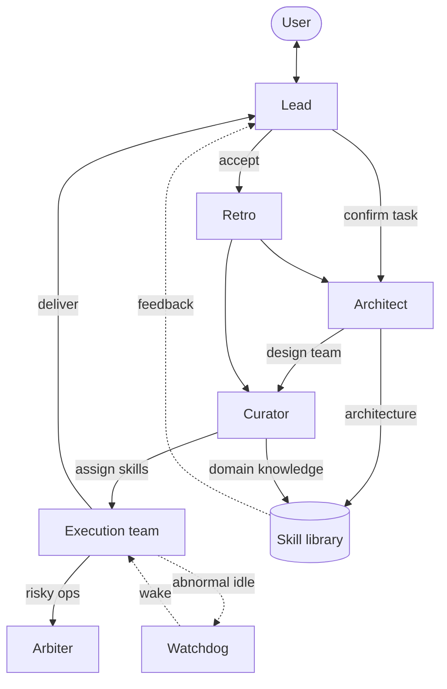

[English](README.md) | [简体中文](README.zh.md)

# Gatehouse

**A self-improving multi-agent team**


Built on [OpenCode](https://opencode.ai) — role-based collaboration, Mission lifecycle, and a visual Portal office.

> [!WARNING]
> **Early Development Notice:** Gatehouse is in early development and is not yet ready for production use. Features may change, break, or be incomplete. Use at your own risk.


<p align="center">
  
</p>


Run the plugin locally and visit `http://127.0.0.1:18471/` to explore the office UI. Portal keeps a local cache so you can still browse past snapshots when OpenCode is offline. A standalone public hub is planned.

---

### Architecture

Gatehouse is built on one premise: **teams are ephemeral; domain knowledge is persistent.**

Each Mission spins up an execution team on demand and releases it when done. What persists across Missions is the skill library, retrospective reports, and architectural learnings—not a fixed roster of agents. The team evolves with your project instead of relying on a permanent org chart.

#### Design principles


| Principle                                  | Description                                                                                                                          |
| ------------------------------------------ | ------------------------------------------------------------------------------------------------------------------------------------ |
| **Persistent knowledge, ephemeral teams**  | Execution teams are created and dissolved per Mission; `.gatehouse/` accumulates domain skills, retros, and architectural experience |
| **Stable outer ring, flexible inner ring** | The core quartet (Lead / Architect / Curator / Arbiter) persists; inner topology is tailored per Mission by Architect                |
| **Closed-loop self-improvement**           | Plan → assemble → execute → accept → retro → skill distillation feeds the next Mission                                               |


#### Core roles

**Lead** — Aligns with your long-term direction and owns the mission queue and acceptance criteria. Plans the roadmap from history and retros; agrees on objectives, constraints, and completion criteria with you; accepts delivery and decides whether to retro or close out.

**Architect** — A persistent, independent agent that answers "what team does this Mission need?" Designs the execution structure and orchestration plan for each Mission; the team dissolves when the Mission ends and is redesigned next time. During retro, reviews how the team collaborated and distills structural lessons into meta-skills for better team design over time.

**Curator** — Independent skill librarian. After Architect designs the team, Curator equips execution members with domain skills; after retro, executors extract skill updates from the work and Curator analyzes, consolidates, and archives them for reuse.

**Arbiter** — Independent permission authority; does not execute Missions. When the team hits risky or sensitive operations, Arbiter centrally decides allow / reject and maintains an audit trail.

#### Execution safeguards

**Watchdog** — Built into the execution team. When a member goes quiet mid-step, Gatehouse nudges them to continue so work does not stall silently.

**Mission lifecycle** — Queue → assemble → execute → accept → retro → skill distillation → complete. Lead confirms the task; Architect assembles the execution team; Curator equips skills and the team starts automatically; after acceptance Lead kicks off retro; Architect and Curator summarize architecture and skills respectively, feeding the next planning cycle.




---

### Installation

**Prerequisites:** [OpenCode](https://opencode.ai) 1.14.40–1.17.x, [Bun](https://bun.sh).

```bash
# Global install (recommended)
bunx @gatehouse/core install

# Verify global layer
bunx @gatehouse/core doctor --global-only

# Project setup (pick one)
bunx @gatehouse/core scaffold -C /path/to/project   # create .gatehouse/ now
cd /path/to/project && opencode                        # or auto-create on first start
```

Full installation guide (including step-by-step LLM Agent instructions): [docs/guide/installation.md](./docs/guide/installation.md)

Models and other advanced settings are not configured during install — edit `~/.config/gatehouse/config.yaml` or `.gatehouse/config.yaml` when needed.

### Quick Start

1. **Launch** — Run `opencode` from the project root to start the TUI (Desktop / IDE extensions are not yet verified).
2. **Talk to Lead** — Describe your goals and constraints; Lead assembles the core team (Architect, Curator, Arbiter, and other roles).
3. **Confirm Mission** — Once aligned, Lead enqueues the task and starts a Mission; Architect assembles a tailored execution team that runs automatically.
4. **Open Portal** — Visit `http://127.0.0.1:18471/` to watch agents in the pixel-art office, follow live orchestration, browse the blog and Skill catalog, and review per-Mission team stats. Turn on **autopilot** when you want Lead to keep momentum during long quiet periods (after direction is confirmed).

For the full user workflow, see the [Getting Started guide](./docs/getting-started.md).

### What You Get

- **Core team** — Lead, Architect, Curator, and Arbiter with clear responsibilities; role display names, models, and locale are customizable in config.
- **Mission lifecycle** — Queue → execute → review → retrospective → skill distillation; team state persists in the project's `.gatehouse/`.
- **Self-improvement** — Retrospectives and skill extraction feed back into future Missions as the team evolves with your project.
- **Portal office** — Pixel-art office with live orchestration sidebar, blog, Skill catalog, and Team Data; falls back to cached snapshots when the backend is offline.
- **IM channels** — Chat remotely with any team member via WeChat, Feishu, QQ, or QQ group (OneBot); optional channel admin UI ([IM Channels guide](./docs/guide/channels.md)).
- **Autopilot** — Optional hands-off mode: after direction is confirmed, Lead can proceed on your behalf when you step away.

### Configuration

Gatehouse uses two configuration layers; project-level overrides global:


| File                              | Purpose                                                      |
| --------------------------------- | ------------------------------------------------------------ |
| `~/.config/gatehouse/config.yaml` | Global defaults: locale, role names, models, Portal branding |
| `.gatehouse/config.yaml`          | Project-level overrides                                      |


Project config is auto-generated on first OpenCode launch. Details: [Getting Started — Configuration](./docs/getting-started.md#configuration).

### Documentation


| Doc                                                        | Description                                   |
| ---------------------------------------------------------- | --------------------------------------------- |
| [docs/getting-started.md](./docs/getting-started.md)       | Quick start, Mission workflow, Portal         |
| [docs/guide/installation.md](./docs/guide/installation.md) | Full installation guide                       |
| [packages/core/README.md](./packages/core/README.md)       | Plugin tool reference (advanced)              |
| [packages/portal/README.md](./packages/portal/README.md)   | Portal development and debugging              |
| [docs/guide/channels.md](./docs/guide/channels.md)         | IM channels (WeChat / Feishu / QQ / QQ group) |
| [docs/dev.md](./docs/dev.md)                               | Monorepo development and contributing         |
| [CHANGELOG.md](./CHANGELOG.md)                             | Release history and known limitations         |
| [docs/README.md](./docs/README.md)                         | Documentation index                           |


A standalone docs site and public Portal hub are planned; links will be added here once deployed.

### Development & Contributing

This repository is the Gatehouse monorepo. Local development, testing, and release workflow: [docs/dev.md](./docs/dev.md).

### Building on OpenCode

Gatehouse is a community plugin built on [OpenCode](https://opencode.ai). It is **not** developed or maintained by the OpenCode team and is not affiliated with OpenCode in any way. Using OpenCode means you agree to its respective terms of use and privacy policy.

Portal office pixel art is from [LimeZu](https://limezu.itch.io/) — thanks to the author for the wonderful work.

---

## Star History

