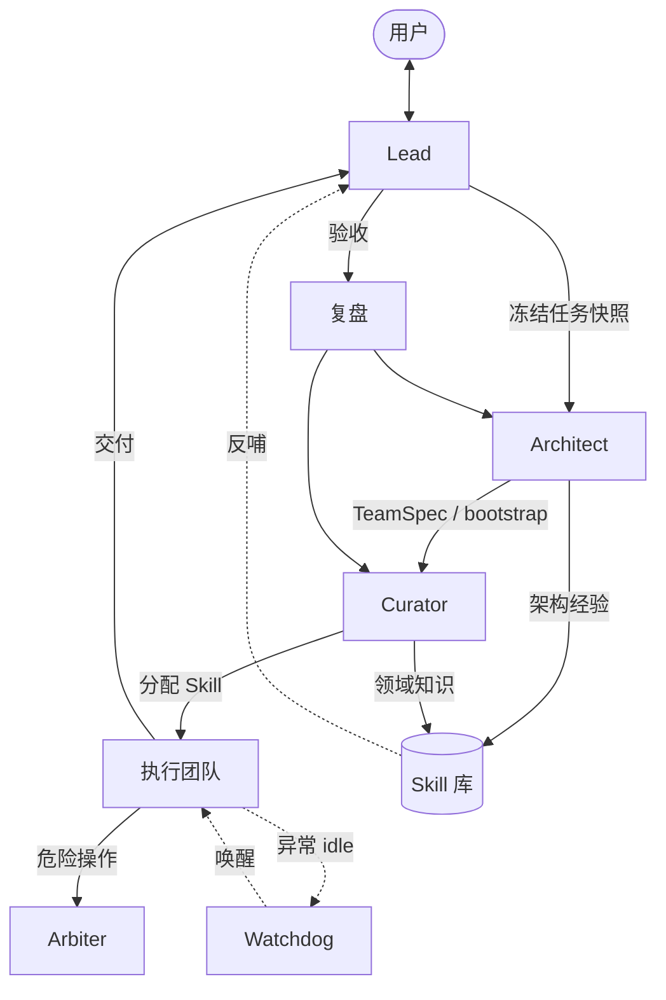

<p align="center">
  <a href="README.md">English</a> |
  <a href="README.zh.md">简体中文</a>
</p>

# Gatehouse

**自我迭代的多智能体团队**

<p align="center">
  <a href="https://opensource.org/licenses/MIT"></a>
  <a href="https://github.com/doee-hc/gatehouse/actions/workflows/ci.yml"></a>
  <a href="https://opencode.ai"></a>
  <a href="https://github.com/doee-hc/gatehouse"></a>
</p>

基于 [OpenCode](https://opencode.ai) — 分工协作、任务生命周期、可视化 Portal 办公室。

> [!WARNING]
> **早期开发提示：** Gatehouse 仍处于早期开发阶段，尚未适合生产环境。功能可能变更、中断或不完整，请自行评估风险。

<p align="center">
  
</p>

本地运行插件后访问 `http://127.0.0.1:18471/` 可查看办公室 UI；独立 Portal 站点规划为对外项目门户。

---

### 架构理念

Gatehouse 的核心假设是：**团队可以随任务生灭，领域知识应当持续积累。**

每次 Mission 按需组建执行团队，任务结束后释放；真正持久化的是 Skill 库、复盘报告与架构经验，而非某一次任务的 agent 阵容。团队能力随项目演进，而不是靠固定编制。

#### 设计原则

| 原则 | 说明 |
| --- | --- |
| **知识持久，团队临时** | 执行团队按 Mission 创建与解散；`.gatehouse/` 沉淀领域 Skill、复盘与架构经验 |
| **外层稳定，内层灵活** | 核心四人组（Lead / Architect / Curator / Arbiter）长期存在；内层拓扑由 Architect 按任务定制 |
| **分工闭环，自我迭代** | 规划 → 建队 → 执行 → 验收 → 复盘 → Skill 沉淀，形成可复用的改进回路 |

#### 核心角色

**Lead（统筹）** — 面向用户的长期方向，维护任务队列与验收标准。结合历史评价与复盘结论规划路线；与你对齐目标、约束与完成条件后启动 Mission；对照 `done_when` 验收交付，决定是否进入复盘或收尾。

**Architect（架构）** — 持久化的独立 agent，负责「这支任务需要怎样的团队」。根据 Mission 快照设计 TeamSpec（分几个 agent、几层协调），任务结束后团队解散，下次任务重新设计。复盘时分析全员上下文，从 token 消耗、工具调用、agent 间通信、执行时间等维度评估协作效率（量化方式由 Architect 在实战中探索），并将「某类任务适合怎样的团队结构」沉淀为 meta-skill，持续改进建队策略。

**Curator（策展）** — 独立的 Skill 管理 agent。Architect 完成拓扑后，由 Curator 为各执行节点分配细分领域 Skill；复盘阶段，执行者从任务中提炼 Skill 更新，Curator 分析、整理并归档到领域库，供后续 Mission 复用。

**Arbiter（仲裁）** — 独立的权限决断 agent，不参与任务执行。当团队遇到危险或敏感操作时，由 Arbiter 统一裁决 allow / reject，并记录审计日志，避免执行层各自为政。

#### 执行保障

**看门狗（Watchdog）** — 执行团队内置空闲监测。当全员异常 idle（例如某 agent 已完成工作却未向上汇报、或任务已全部完成却未通知 Lead 暂停监测）时，看门狗唤醒任务协调者检查状态，减少执行中途无声卡住。

**Mission 生命周期** — 排队 → 建队 → 执行 → 验收 → 复盘 → Skill 沉淀 → 完成。Lead 冻结任务快照，Architect 写 TeamSpec 并 bootstrap，Curator 分配 Skill 后执行团队自动启动；验收通过后 Lead 启动复盘，Architect 与 Curator 分别汇总架构与 Skill 结论，反哺下一次任务规划。



---

### 安装

**前置条件：** 已安装 [OpenCode](https://opencode.ai) >= 1.14.40。

```bash
# 注册 Gatehouse 插件（全局，一次即可）
opencode plug @gatehouse/core --global

# 或使用安装助手（推荐：可配置 locale / 模型）
bunx @gatehouse/core install

# 验证安装
bunx @gatehouse/core doctor
```

完整安装指南（含 LLM Agent 逐步说明）：[docs/guide/installation.zh.md](./docs/guide/installation.zh.md)

然后在**你的项目目录**启动 OpenCode。插件会自动初始化 `.gatehouse/` 配置与 agent 定义，并将默认对话 agent 设为 **Lead**（显示名可在配置中修改）。

### 快速开始

1. **启动** — 在项目根目录运行 `opencode` 启动 TUI（Desktop / IDE 扩展尚未验证）。
2. **与 Lead 对话** — 说明目标与约束；Lead 会组建核心团队（架构、策展、仲裁等角色）。
3. **确认任务** — 方向对齐后，Lead 将任务写入队列并启动；内层执行团队由插件自动编排。
4. **打开 Portal** — 浏览器访问 `http://127.0.0.1:18471/`，在办公室视图里观察各 agent 的状态与协作；任务产出可发布到 Portal 博客，沉淀的 Skill 可在 Skill 栏浏览。

更完整的用户流程见 [快速上手指南](./docs/getting-started.zh.md)。

### 你能得到什么

- **核心团队** — Lead、Architect、Curator、Arbiter 分工明确；角色显示名与模型可在配置中自定义。
- **任务生命周期** — 排队 → 执行 → 验收 → 复盘 → 技能沉淀；团队状态持久化在项目 `.gatehouse/` 中。
- **自我迭代** — 复盘与技能提取会反哺后续任务，团队能力随项目演进。
- **Portal 办公室** — Phaser 像素风办公室：agent 忙碌时在工位、空闲时走动；附带博客与 Skill Tab。
- **IM 通道** — 通过微信 / 飞书 / QQ 与任意团队成员远程对话（[IM 通道指南](./docs/guide/channels.zh.md)）。

### 配置

Gatehouse 使用两层配置，项目级覆盖全局级：

| 文件 | 用途 |
| --- | --- |
| `~/.config/gatehouse/config.yaml` | 全局：角色显示名、默认模型、Portal 品牌 |
| `.gatehouse/config.yaml` | 项目级覆盖 |

首次启动 OpenCode 时会自动生成项目配置。详细说明见 [快速上手指南 — 配置](./docs/getting-started.zh.md#配置)。

### 文档

| 文档 | 说明 |
| --- | --- |
| [docs/getting-started.zh.md](./docs/getting-started.zh.md) | 用户快速上手、任务流程、Portal |
| [docs/guide/installation.zh.md](./docs/guide/installation.zh.md) | 完整安装指南 |
| [packages/core/README.md](./packages/core/README.md) | 插件工具参考（进阶，英文） |
| [packages/portal/README.md](./packages/portal/README.md) | Portal 开发与调试（英文） |
| [docs/guide/channels.zh.md](./docs/guide/channels.zh.md) | IM 通道（微信 / 飞书 / QQ） |
| [docs/dev.md](./docs/dev.md) | 本仓库开发与贡献（英文） |
| [CHANGELOG.md](./CHANGELOG.md) | 版本历史与已知限制 |
| [docs/README.zh.md](./docs/README.zh.md) | 文档索引 |

独立文档站点与对外 Portal 门户正在规划中；部署后将在此补充链接。

### 开发与贡献

本仓库为 Gatehouse monorepo。本地开发、测试与发布流程见 [docs/dev.md](./docs/dev.md)。

### 基于 OpenCode 进行开发

Gatehouse 是基于 [OpenCode](https://opencode.ai) 的社区插件，**并非** OpenCode 官方团队开发或维护，与 OpenCode 无任何隶属关系。使用 OpenCode 即表示你同意其各自的使用条款与隐私政策。

Portal 办公室的像素美术素材来自 [LimeZu](https://limezu.itch.io/)，感谢作者的精彩创作。

---

## Star 曲线

<a href="https://www.star-history.com/?repos=doee-hc%2Fgatehouse&type=date&legend=top-left">
  <picture>
    <source media="(prefers-color-scheme: dark)" srcset="https://api.star-history.com/image?repos=doee-hc/gatehouse&type=date&theme=dark&legend=top-left" />
    <source media="(prefers-color-scheme: light)" srcset="https://api.star-history.com/image?repos=doee-hc/gatehouse&type=date&legend=top-left" />
    
  </picture>
</a>
