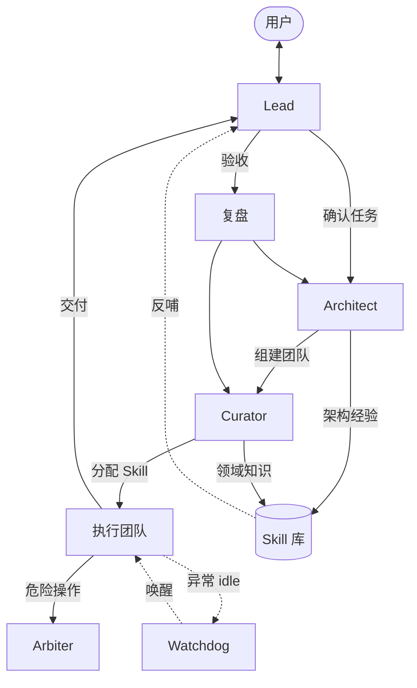

[English](README.md) | [简体中文](README.zh.md)

# Gatehouse

**自我迭代的多智能体团队**

基于 [OpenCode](https://opencode.ai) — 分工协作、任务生命周期、可视化 Portal 办公室。

> [!WARNING]
> **早期开发提示：** Gatehouse 仍处于早期开发阶段，尚未适合生产环境。功能可能变更、中断或不完整，请自行评估风险。


<p align="center">
  
</p>

本地运行插件后访问 `http://127.0.0.1:18471/` 可查看办公室 UI；Portal 会缓存本地快照，OpenCode 离线时仍可浏览历史内容。对外独立门户站点仍在规划中。

---

### 架构理念

Gatehouse 的核心假设是：**团队可以随任务生灭，领域知识应当持续积累。**

每次 Mission 按需组建执行团队，任务结束后释放；真正持久化的是 Skill 库、复盘报告与架构经验，而非某一次任务的 agent 阵容。团队能力随项目演进，而不是靠固定编制。

#### 设计原则


| 原则            | 说明                                                                    |
| ------------- | --------------------------------------------------------------------- |
| **知识持久，团队临时** | 执行团队按 Mission 创建与解散；`.gatehouse/` 沉淀领域 Skill、复盘与架构经验                  |
| **外层稳定，内层灵活** | 核心四人组（Lead / Architect / Curator / Arbiter）长期存在；内层拓扑由 Architect 按任务定制 |
| **分工闭环，自我迭代** | 规划 → 建队 → 执行 → 验收 → 复盘 → Skill 沉淀，形成可复用的改进回路                          |


#### 核心角色

**Lead（统筹）** — 面向用户的长期方向，维护任务队列与验收标准。结合历史评价与复盘结论规划路线；与你对齐目标、约束与完成条件后启动 Mission；验收交付后决定是否进入复盘或收尾。

**Architect（架构）** — 持久化的独立 agent，负责「这支任务需要怎样的团队」。为每个 Mission 设计执行结构与编排方案，任务结束后团队解散，下次任务重新设计。复盘时回顾团队协作方式，将结构经验沉淀为 meta-skill，持续改进建队策略。

**Curator（策展）** — 独立的 Skill 管理 agent。Architect 完成团队设计后，由 Curator 为各执行成员配备领域 Skill；复盘阶段，执行者从任务中提炼 Skill 更新，Curator 分析、整理并归档到领域库，供后续 Mission 复用。

**Arbiter（仲裁）** — 独立的权限决断 agent，不参与任务执行。当团队遇到危险或敏感操作时，由 Arbiter 统一裁决 allow / reject，并记录审计日志，避免执行层各自为政。

#### 执行保障

**看门狗（Watchdog）** — 执行团队内置进度监测。当某位成员在执行中途长时间无响应时，Gatehouse 会提醒其继续推进，避免任务无声卡住。

**Mission 生命周期** — 排队 → 建队 → 执行 → 验收 → 复盘 → Skill 沉淀 → 完成。Lead 确认任务；Architect 组建执行团队；Curator 配备 Skill 后团队自动启动；验收通过后 Lead 启动复盘，Architect 与 Curator 分别汇总架构与 Skill 结论，反哺下一次任务规划。




---

### 安装

**前置条件：** [OpenCode](https://opencode.ai) 1.14.40–1.17.x，[Bun](https://bun.sh)。

```bash
# 全局安装（推荐）
bunx @gatehouse/core install

# 验证全局层
bunx @gatehouse/core doctor --global-only

# 项目初始化（二选一）
bunx @gatehouse/core scaffold -C /path/to/project   # 提前创建 .gatehouse/
cd /path/to/project && opencode                        # 或首次启动时自动创建
```

完整安装指南（含 LLM Agent 逐步说明）：[docs/guide/installation.zh.md](./docs/guide/installation.zh.md)

模型等高级配置不在安装阶段设置，需要时编辑 `~/.config/gatehouse/config.yaml` 或 `.gatehouse/config.yaml`。

### 快速开始

1. **启动** — 在项目根目录运行 `opencode` 启动 TUI（Desktop / IDE 扩展尚未验证）。
2. **与 Lead 对话** — 说明目标与约束；Lead 会组建核心团队（架构、策展、仲裁等角色）。
3. **确认任务** — 方向对齐后，Lead 将任务写入队列并启动 Mission；Architect 按需组建执行团队并自动推进。
4. **打开 Portal** — 浏览器访问 `http://127.0.0.1:18471/`，在像素风办公室里观察 agent 状态与实时编排，浏览博客与 Skill 目录，查看各任务团队数据。方向确认后可开启 **autopilot**，在你长时间离开时由 Lead 保持推进节奏。

更完整的用户流程见 [快速上手指南](./docs/getting-started.zh.md)。

### 你能得到什么

- **核心团队** — Lead、Architect、Curator、Arbiter 分工明确；角色显示名、模型与语言可在配置中自定义。
- **任务生命周期** — 排队 → 执行 → 验收 → 复盘 → 技能沉淀；团队状态持久化在项目 `.gatehouse/` 中。
- **自我迭代** — 复盘与技能提取会反哺后续任务，团队能力随项目演进。
- **Portal 办公室** — 像素风办公室、实时编排侧栏、博客、Skill 目录与团队数据；后端离线时可回退到本地缓存快照。
- **IM 通道** — 通过微信、飞书、QQ 或 QQ 群（OneBot）与任意团队成员远程对话；可选频道管理界面（[IM 通道指南](./docs/guide/channels.zh.md)）。
- **Autopilot** — 可选的全权模式：方向确认后，你暂时离开时 Lead 可代为推进。

### 配置

Gatehouse 使用两层配置，项目级覆盖全局级：


| 文件                                | 用途                       |
| --------------------------------- | ------------------------ |
| `~/.config/gatehouse/config.yaml` | 全局默认：语言、角色名、模型、Portal 品牌 |
| `.gatehouse/config.yaml`          | 项目级覆盖                    |


首次启动 OpenCode 时会自动生成项目配置。详细说明见 [快速上手指南 — 配置](./docs/getting-started.zh.md#配置)。

### 文档


| 文档                                                               | 说明                         |
| ---------------------------------------------------------------- | -------------------------- |
| [docs/getting-started.zh.md](./docs/getting-started.zh.md)       | 用户快速上手、任务流程、Portal         |
| [docs/guide/installation.zh.md](./docs/guide/installation.zh.md) | 完整安装指南                     |
| [packages/core/README.md](./packages/core/README.md)             | 插件工具参考（进阶，英文）              |
| [packages/portal/README.md](./packages/portal/README.md)         | Portal 开发与调试（英文）           |
| [docs/guide/channels.zh.md](./docs/guide/channels.zh.md)         | IM 通道（微信 / 飞书 / QQ / QQ 群） |
| [docs/dev.md](./docs/dev.md)                                     | 本仓库开发与贡献（英文）               |
| [CHANGELOG.md](./CHANGELOG.md)                                   | 版本历史与已知限制                  |
| [docs/README.zh.md](./docs/README.zh.md)                         | 文档索引                       |


独立文档站点与对外 Portal 门户正在规划中；部署后将在此补充链接。

### 开发与贡献

本仓库为 Gatehouse monorepo。本地开发、测试与发布流程见 [docs/dev.md](./docs/dev.md)。

### 基于 OpenCode 进行开发

Gatehouse 是基于 [OpenCode](https://opencode.ai) 的社区插件，**并非** OpenCode 官方团队开发或维护，与 OpenCode 无任何隶属关系。使用 OpenCode 即表示你同意其各自的使用条款与隐私政策。

Portal 办公室的像素美术素材来自 [LimeZu](https://limezu.itch.io/)，感谢作者的精彩创作。

---

## Star 曲线

